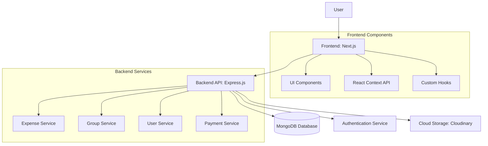

# <div align="center">🌟 SplitEase - Split Bills With Friends Easily 🌟</div>

<div align="center">

[](https://nextjs.org/)
[](https://www.typescriptlang.org/)
[](https://tailwindcss.com/)
[](https://www.mongodb.com/)
[](https://nodejs.org/)

</div>

<div align="center">
  
</div>

<div align="center">
  <h3>🔥 Effortlessly Split Bills, Track Expenses & Settle Payments with Friends 🔥</h3>
  <p><i>Never have another awkward "who owes what" conversation again!</i></p>
</div>

## 🎬 Demo & Screenshots

<details>
<summary>📱 Mobile View</summary>
<div align="center">
  
</div>
</details>

<details>
<summary>💻 Desktop Dashboard</summary>
<div align="center">
  
</div>
</details>

<details>
<summary>📊 Expense Analytics</summary>
<div align="center">
  
</div>
</details>

## ✨ Why SplitEase?

Have you ever found yourself stuck with a calculator trying to figure out who owes what after a dinner? Or chasing roommates for utility bills month after month? **SplitEase solves all of that!**

- 🧠 **Smart Splitting** - Equal, percentage, or custom splits with just a few taps
- 🔍 **Crystal Clear** - See who owes what at a glance
- 🎯 **Stay on Target** - Track group expenses and settlement ratios
- 📱 **Anywhere, Anytime** - Fully responsive across all devices

## ✅ Feature Highlights

<table>
  <tr>
    <td width="33%">
      <h3 align="center">💸 Expense Management</h3>
      <ul>
        <li>Multiple split methods (Equal, %, Custom)</li>
        <li>Expense categorization</li>
        <li>Receipt photo uploads</li>
        <li>Recurring expense support</li>
      </ul>
    </td>
    <td width="33%">
      <h3 align="center">👥 Group Management</h3>
      <ul>
        <li>Create themed groups (Travel, Household, etc.)</li>
        <li>Invite via email or in-app</li>
        <li>Group statistics & insights</li>
        <li>Activity tracking & history</li>
      </ul>
    </td>
    <td width="33%">
      <h3 align="center">📊 Visual Analytics</h3>
      <ul>
        <li>Category-based pie charts</li>
        <li>Monthly spending trends</li>
        <li>Settlement progress tracking</li>
        <li>Customizable date ranges</li>
      </ul>
    </td>
  </tr>
  <tr>
    <td width="33%">
      <h3 align="center">💰 Payment System</h3>
      <ul>
        <li>Multiple payment methods</li>
        <li>Settlement verification</li>
        <li>Payment request notifications</li>
        <li>Transaction history</li>
      </ul>
    </td>
    <td width="33%">
      <h3 align="center">🔐 Secure Authentication</h3>
      <ul>
        <li>JWT with HTTP-only cookies</li>
        <li>Google OAuth integration</li>
        <li>Password reset functionality</li>
        <li>Account management</li>
      </ul>
    </td>
    <td width="33%">
      <h3 align="center">✨ User Experience</h3>
      <ul>
        <li>Smooth animations with Framer Motion</li>
        <li>Intuitive UI/UX design</li>
        <li>Dark/light theme support</li>
        <li>Responsive across all devices</li>
      </ul>
    </td>
  </tr>
</table>

## 🔨 Technology Stack & Architecture

### 🏗️ Architecture Overview



### 🎭 Frontend (This Repository)

<details>
<summary>View detailed tech stack</summary>

| Category               | Technologies                       |
| ---------------------- | ---------------------------------- |
| **Framework**          | Next.js 15 with App Router         |
| **Language**           | TypeScript                         |
| **Styling**            | TailwindCSS with custom animations |
| **State Management**   | React Context API                  |
| **Authentication**     | JWT with HTTP-only cookies         |
| **Data Visualization** | Chart.js with react-chartjs-2      |
| **Animations**         | Framer Motion                      |
| **Icons**              | FontAwesome                        |
| **HTTP Client**        | Axios                              |
| **Form Management**    | React Hook Form                    |

</details>

### 🧠 Backend

<details>
<summary>View backend tech stack</summary>

| Category              | Technologies                    |
| --------------------- | ------------------------------- |
| **Runtime**           | Node.js                         |
| **Framework**         | Express.js                      |
| **Database**          | MongoDB with Mongoose           |
| **Authentication**    | JWT, Google OAuth               |
| **Cloud Storage**     | Cloudinary (for profile images) |
| **API Documentation** | Swagger/OpenAPI                 |

👉 [View Backend Repository](https://github.com/CodeTirtho97/SplitEase_backend)

</details>

## 🚀 Getting Started

### Requirements

- Node.js 18+ installed
- npm or yarn package manager
- MongoDB instance (local or Atlas)

### Quick Start

1. **Clone & Install**

   ```bash
   # Clone the repository
   git clone https://github.com/your-username/splitease-frontend.git
   cd splitease-frontend

   # Install dependencies
   npm install
   ```

2. **Configure Environment**

   ```bash
   # Create .env.local file
   cp .env.example .env.local

   # Edit your environment variables
   nano .env.local
   ```

3. **Start Development Server**

   ```bash
   npm run dev
   ```

4. **Open Browser**
   ```
   http://localhost:3000
   ```

### 🏗️ Project Structure

<details>
<summary>View folder structure</summary>

```
📂 SplitEase-Frontend
├── 📂 app/                      # Next.js App Router pages
│   ├── 📂 auth/                 # Authentication-related pages
│   ├── 📂 dashboard/            # User dashboard
│   ├── 📂 expenses/             # Expense management
│   ├── 📂 groups/               # Group management
│   ├── 📂 payments/             # Payment processing
│   ├── 📂 profile/              # User profile
│   └── 📄 layout.tsx            # Root layout component
├── 📂 components/               # Reusable UI components
│   ├── 📄 Button.tsx            # Custom button component
│   ├── 📄 ExpenseModal.tsx      # Expense creation modal
│   ├── 📄 Navbar.tsx            # Navigation component
│   └── ... (20+ components)
├── 📂 context/                  # React Context providers
│   ├── 📄 authContext.tsx       # Authentication context
│   ├── 📄 groupContext.tsx      # Group management context
│   └── ... (4 contexts)
├── 📂 public/                   # Static assets
├── 📂 utils/                    # Utility functions
│   └── 📂 api/                  # API client functions
└── 📂 types/                    # TypeScript type definitions
```

</details>

## 🤝 Contributing

Contributions are what make the open-source community such an amazing place to learn, inspire, and create. Any contributions you make are **greatly appreciated**.

<details>
<summary>How to contribute</summary>

1. Fork the Project
2. Create your Feature Branch (`git checkout -b feature/AmazingFeature`)
3. Commit your Changes (`git commit -m 'Add some AmazingFeature'`)
4. Push to the Branch (`git push origin feature/AmazingFeature`)
5. Open a Pull Request

</details>

## 🎨 UI/UX Highlights

- **Intuitive Interfaces** with minimal learning curve
- **Micro-interactions** for user engagement
- **Animated transitions** for seamless navigation
- **Mobile-first approach** with responsive layouts
- **Consistent design language** across all components

## 🛣️ Roadmap

- [ ] **Native Mobile App** using React Native
- [ ] **Push Notifications** for real-time updates
- [ ] **Currency conversion** based on real-time exchange rates
- [ ] **Expense scanning** with OCR technology
- [ ] **Budget planning** and expense forecasting
- [ ] **Group expense suggestions** with AI

## 📫 Contact & Support

<div align="center">

[](https://linkedin.com/in/tirthoraj-bhattacharya/)
[](https://github.com/CodeTirtho97)
[](https://twitter.com/lucifer_7951)

</div>

## 📄 License

This project is licensed under the MIT License - see the LICENSE file for details.

<div align="center">

**Made with ❤️ by [CodeTirtho97](https://github.com/CodeTirtho97)**


</div>
